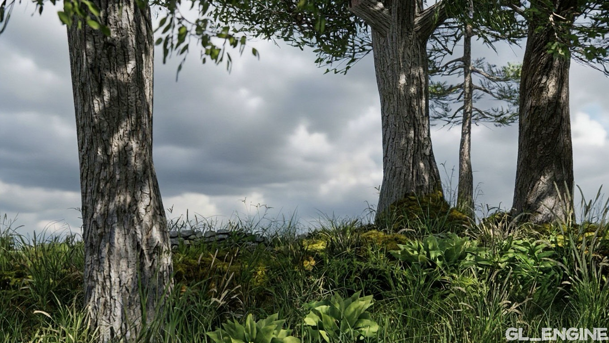

# GL_Engine 1.2
**Welcome official page of GL_Engine!**

#Showcasts:

  
  

**What is GL_Engine?**
Previously, did you have to make models in one program and import them into the program where you made your game? With GL_Engine, you can create models and create a game in one program at a professional level thanks to the professional tools built into our engine!

#Logo:

